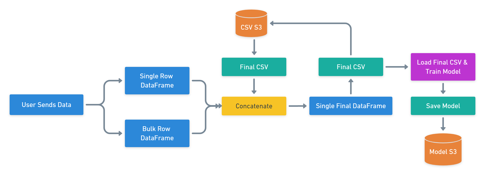

# Model Retraining

!!! warning "Retrain"

	We're using AWS Lambda for model retraining. Make sure you've AWS CLI configured in your development machine. 
	You also need to deploy chalice in order to allow retraining function to work. After deployment replace retrain url in `index.html` & `main.js` with yours.

## Retraining Overview



## Single & Bulk Row Retraining

### Install AWS Chalice

```
pip install chalice
```

### Create Chalice Project

```
chalice new-project retrain
```

```
cd retrain
```

### Folder Structure

```
./retrain/
├── app.py
└── requirements.txt
```

### requirements.txt

```
pandas
boto3
s3fs
sklearn
pickle
```

### app.py

```python
from chalice import Chalice
import pandas as pd
import sklearn
from sklearn.ensemble import RandomForestClassifier
from sklearn import model_selection
from sklearn.model_selection import train_test_split
import pickle
import boto3
import s3fs
app = Chalice(app_name='retrain')
@app.route('/single', methods=['POST'])
def single():
	body = app.current_request.json_body
	df = pd.read_csv('s3://finalcsv/HTRU_2.csv')
	data = {'mean_int_pf':  [body['mean_int_pf']],
		'std_pf': [body['std_pf']],
        'ex_kurt_pf': [body['ex_kurt_pf']],
        'skew_pf': [body['skew_pf']],
        'mean_dm': [body['mean_dm']],
        'std_dm': [body['std_dm']],
        'kurt_dm': [body['kurt_dm']],
        'skew_dm': [body['skew_dm']],
        'class': body['class'],
        }
    df2 = pd.DataFrame(data, columns = ['mean_int_pf', 'std_pf', 'ex_kurt_pf', 'skew_pf', 'mean_dm', 'std_dm', 'kurt_dm', 'skew_dm', 'class'])
	frames = [df, df2]
	result = pd.concat(frames, ignore_index=True)
	result.to_csv('s3://finalcsv/HTRU_2.csv', index=False)
	features = result.drop('class', axis=1)
	targets = result['class']
	X_train, X_test, y_train, y_test = train_test_split(features, targets, test_size=0.30, random_state=66)
	RFC = RandomForestClassifier(bootstrap=False, ccp_alpha=0.0, class_weight=None,
	                       criterion='entropy', max_depth=90, max_features='auto',
	                       max_leaf_nodes=None, max_samples=None,
	                       min_impurity_decrease=0.0, min_impurity_split=None,
	                       min_samples_leaf=2, min_samples_split=10,
	                       min_weight_fraction_leaf=0.0, n_estimators=70, n_jobs=-1,
	                       oob_score=False, random_state=1007, verbose=0,
	                       warm_start=False)
	RFC.fit(X_train,y_train)
	bucket='finalcsv'
	key='model.pkl'
	pickle_byte_obj = pickle.dumps([RFC]) 
	s3_resource = boto3.resource('s3')
	s3_resource.Object(bucket,key).put(Body=pickle_byte_obj)
	return 'single retrain success'

@app.route('/bulk', methods=['POST'])
def bulk():
	body = app.current_request.json_body
	df = pd.read_csv('s3://finalcsv/HTRU_2.csv')
    df2 = pd.read_csv('s3://finalcsv/temp.csv')
	frames = [df, df2]
	result = pd.concat(frames, ignore_index=True)
	result.to_csv('s3://finalcsv/HTRU_2.csv', index=False)
	features = result.drop('class', axis=1)
	targets = result['class']
	X_train, X_test, y_train, y_test = train_test_split(features, targets, test_size=0.30, random_state=66)
	RFC = RandomForestClassifier(bootstrap=False, ccp_alpha=0.0, class_weight=None,
	                       criterion='entropy', max_depth=90, max_features='auto',
	                       max_leaf_nodes=None, max_samples=None,
	                       min_impurity_decrease=0.0, min_impurity_split=None,
	                       min_samples_leaf=2, min_samples_split=10,
	                       min_weight_fraction_leaf=0.0, n_estimators=70, n_jobs=-1,
	                       oob_score=False, random_state=1007, verbose=0,
	                       warm_start=False)
	RFC.fit(X_train,y_train)
	bucket='finalcsv'
	key='model.pkl'
	pickle_byte_obj = pickle.dumps([RFC]) 
	s3_resource = boto3.resource('s3')
	s3_resource.Object(bucket,key).put(Body=pickle_byte_obj)
	return 'bulk retrain success'
```

### Deploy Chalice

!!! success "Copy URL"

	After deploying you'll get an API Endpoint URL. Replace retrain url in `index.html` & `main.js` with yours.

```
chalice deploy
```

### Delete Chalice

```
chalice delete
```

